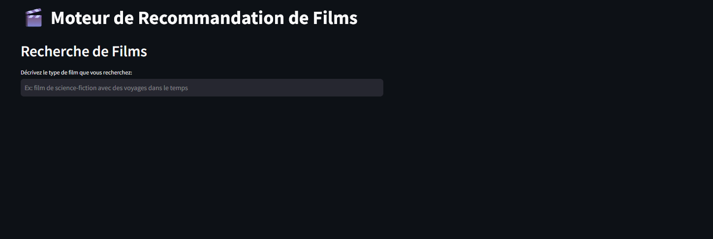
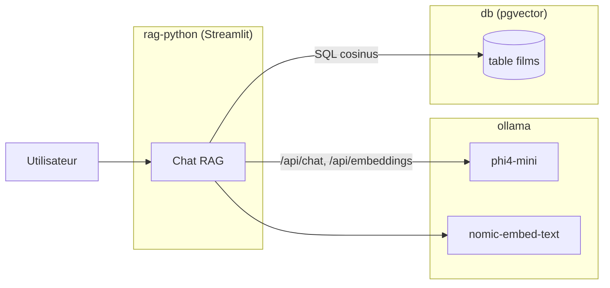

# RAG Ollama Streamlit

**Application de RAG (Retrieval Augmented Generation) 100 % local : interrogez une base
de films en langage naturel, avec Ollama, PostgreSQL (pgvector) et Streamlit.**




## Description

Ce projet permet d'interroger une base de connaissances de films en langage naturel. Il
combine :
1. **Recherche vectorielle (Retrieval)** : trouve les films les plus pertinents via
   `pgvector` et les embeddings `nomic-embed-text` (768 dimensions).
2. **Génération (Generation)** : utilise le LLM `phi4-mini` pour synthétiser une réponse
   à partir des synopsis trouvés.

**Technologies :**
- **Ollama** : LLM & embeddings (local GPU/CPU).
- **PostgreSQL + pgvector** : base de données vectorielle.
- **Streamlit** : interface de chat & gestion.
- **Python** : backend RAG avec *connection pooling* pour la performance.

## Architecture

Le projet est composé de **3 services Docker** interconnectés sur le réseau privé
`app-network` :

1. **ollama** : serveur d'inférence LLM + embeddings.
2. **db** : base PostgreSQL vectorielle (pgvector).
3. **rag-python** : application Streamlit (port interne 8501) + Jupyter (8888).



> Détails : [documentation/architecture.md](documentation/architecture.md)

## Documentation

| Document | Contenu |
|---|---|
| [architecture.md](documentation/architecture.md) | Services, flux de bout en bout, décisions, réseaux/volumes |
| [SECURITY.md](documentation/SECURITY.md) | Secrets, isolation réseau, dépendances, risques connus |
| [STORAGE.md](documentation/STORAGE.md) | Schéma `films`, index vectoriel, volumes persistants |
| [services/ollama.md](documentation/services/ollama.md) | Serveur d'inférence Ollama |
| [services/db.md](documentation/services/db.md) | PostgreSQL + pgvector |
| [services/rag-python.md](documentation/services/rag-python.md) | Application Streamlit |
| [QUICKSTART.md](QUICKSTART.md) | Démarrage rapide pas à pas |

## Prérequis

- **Docker** et **Docker Compose**
- **NVIDIA Container Toolkit** (recommandé — une réservation GPU nvidia est déclarée
  dans le compose ; l'exécution CPU reste possible mais lente)

## Démarrage

Le projet nécessite un fichier `.env` à la racine (voir [QUICKSTART.md](QUICKSTART.md)
pour le contenu minimal ; aucun `.env.example` n'est versionné).

```bash
docker compose up -d --build
```

Cette commande démarre Ollama (et télécharge `phi4-mini` + `nomic-embed-text`),
initialise PostgreSQL, puis lance l'application (qui attend que les modèles soient prêts).

| Service | URL | Note |
|---|---|---|
| Application Streamlit | http://localhost:8502 | Interface principale (chat RAG) |
| Jupyter Notebook | http://localhost:8888 | Sans jeton — usage local uniquement |
| API Ollama | http://localhost:11435 | Port hôte par défaut (`OLLAMA_PORT`), voir note |
| PostgreSQL | localhost:5432 | Accès SQL direct |

> Le port hôte Ollama vaut `${OLLAMA_PORT:-11435}` (défaut **11435**) mappé vers `11434`
> interne. La valeur effective dépend de votre `.env`.

## Configuration

Variables lues dans `.env` (racine) :

| Variable | Défaut | Effet |
|---|---|---|
| `DB_HOST` | `db` | Hôte PostgreSQL (nom du service) |
| `DB_PORT` | `5432` | Port PostgreSQL |
| `DB_USER` | `postgres` | Utilisateur applicatif |
| `DB_PASSWORD` | `postgres` | Mot de passe applicatif |
| `DB_NAME` | `rag_db` | Base cible |
| `POSTGRES_USER` | `postgres` | Superutilisateur créé au boot de l'image |
| `POSTGRES_PASSWORD` | `postgres` | Mot de passe de ce compte |
| `POSTGRES_DB` | `rag_db` | Base créée au premier démarrage |
| `OLLAMA_HOST` | `http://ollama:11434` | URL de l'API Ollama utilisée par l'app |
| `OLLAMA_PORT` | `11435` | Port hôte mappé vers `11434` (défini dans `docker-compose.yml`) |

## Fonctionnalités

- **Chat RAG** : posez une question (« Quel film parle de rêves ? ») et obtenez une
  réponse générée par l'IA + les sources.
- **Performance** : *connection pool* psycopg2 (1→10) pour une réactivité instantanée.
- **Robustesse** : démarrage sécurisé (attente du téléchargement des modèles).
- **Gestion** : import CSV (`title`, `synopsis`) et ajout manuel de films depuis la
  sidebar.

## Tests

Aucun test automatisé n'est présent dans le dépôt à ce jour (voir la section
« Limites » de [architecture.md](documentation/architecture.md#8-limites-connues--pistes)).

## Structure du projet

```text
RAG_Ollama_Streamlit/
├── .env                    # Configuration et secrets (dans .gitignore mais versionné — voir SECURITY.md)
├── docker-compose.yml      # Orchestration des 3 services
├── data/
│   └── films.csv           # Jeu de données initial
├── db/
│   └── init.sql            # Init SQL (extension vector + table films)
├── ollama/
│   └── entrypoint.sh       # Boot Ollama + pull des modèles
├── python/                 # Service rag-python
│   ├── dockerfile          # Image python:3.11-slim
│   ├── entrypoint.sh       # Attente deps + init + Streamlit/Jupyter
│   ├── initialize_db.py    # Création BDD/table/index + chargement CSV
│   ├── streamlit_app.py    # Application RAG + chat
│   └── requirements.txt    # Dépendances Python
├── documentation/          # Documentation technique (cette doc)
├── QUICKSTART.md           # Démarrage rapide
└── README.md
```

## Licences & composants

| Composant | Rôle | Licence |
|---|---|---|
| Ollama | Serveur LLM local | MIT |
| `phi4-mini` (Microsoft Phi-4) | LLM génération / nettoyage requête | MIT `<à confirmer selon le tag téléchargé>` |
| `nomic-embed-text` (Nomic AI) | Embeddings 768d | Apache-2.0 `<à confirmer selon le tag téléchargé>` |
| PostgreSQL | Base de données relationnelle | PostgreSQL License (open-source) |
| pgvector | Extension recherche vectorielle | PostgreSQL License |
| Streamlit | Interface web | Apache-2.0 |
| psycopg2-binary | Driver PostgreSQL | LGPL-3.0 |
| pandas | Manipulation de données | BSD-3-Clause |
| requests | Client HTTP | Apache-2.0 |
| numpy | Calcul numérique | BSD-3-Clause |
| Jupyter / notebook | Environnement notebook | BSD-3-Clause |
| Python | Runtime | PSF License |
| **Ce projet** | Code applicatif | MIT — Copyright (c) 2026 floSa |

> Les licences des modèles dépendent du tag effectivement téléchargé par Ollama et sont
> à vérifier sur leurs pages respectives. Aucun fichier `LICENSE` n'est présent dans le
> dépôt à ce jour.
