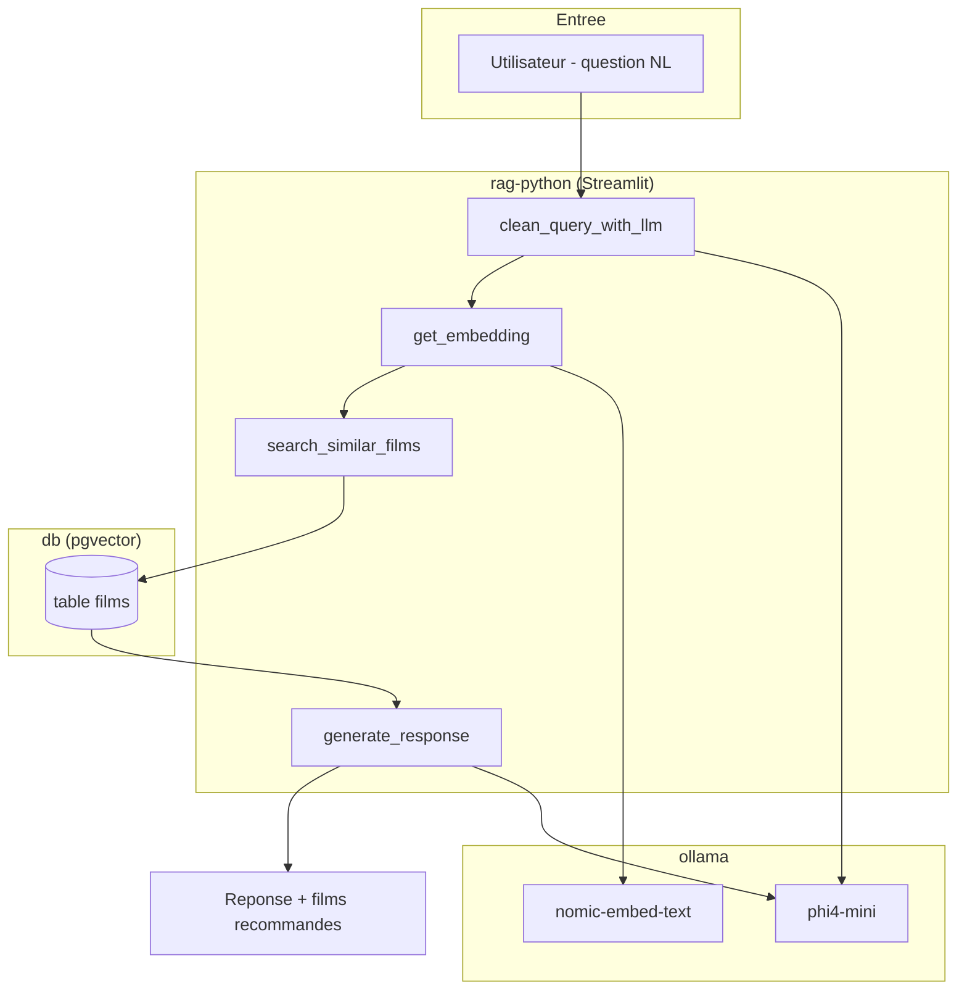
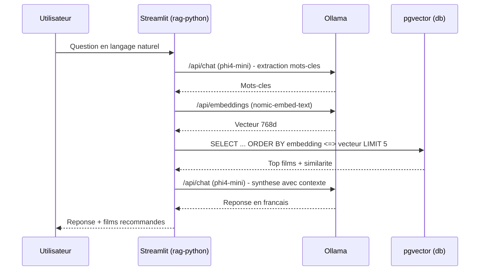

# Architecture — RAG Ollama Streamlit

## 1. Vue d'ensemble

Le système est un **RAG (Retrieval Augmented Generation)** 100 % local sur une base
de connaissances de films. Trois conteneurs Docker coopèrent sur un réseau privé :
un serveur d'inférence **Ollama** (LLM + embeddings), une base **PostgreSQL + pgvector**
qui stocke les synopsis et leurs vecteurs, et une **application Streamlit** (service
`rag-python`) qui orchestre le flux *retrieval → génération* et sert l'interface de chat.

Le flux principal : une question en langage naturel est nettoyée par le LLM, transformée
en vecteur, comparée par similarité cosinus aux films de la base, puis les meilleurs
synopsis servent de contexte au LLM pour rédiger la réponse.

---

## 2. Services / Composants

| Service | Image / Build | Port interne | Port hôte | Rôle |
|---|---|---|---|---|
| `ollama` | `ollama/ollama:latest` | `11434` | `${OLLAMA_PORT:-11435}` | Inférence LLM (`phi4-mini`) + embeddings (`nomic-embed-text`) |
| `db` | `pgvector/pgvector:pg15` | `5432` | `5432` | Base relationnelle + vectorielle (extension `vector`) |
| `rag-python` | build `./python` | `8501` (Streamlit), `8888` (Jupyter) | `8502` → `8501`, `8888` → `8888` | Application RAG + init base + notebook |

> Détail par service : [services/ollama.md](services/ollama.md) ·
> [services/db.md](services/db.md) · [services/rag-python.md](services/rag-python.md)

## 3. Stack technologique

| Couche | Technologie | Version |
|---|---|---|
| Interface web | Streamlit | 1.28.1 |
| Runtime app | Python | 3.11-slim |
| LLM (génération + nettoyage requête) | Ollama `phi4-mini:latest` | tag `latest` |
| Embeddings | Ollama `nomic-embed-text:latest` (768 dim) | tag `latest` |
| Serveur d'inférence | Ollama | image `latest` |
| Base vectorielle | PostgreSQL + pgvector | pg15 |
| Driver SQL | psycopg2-binary | 2.9.9 |
| Notebook | Jupyter / notebook | 1.0.0 / 7.0.6 |
| Traitement données | pandas | 2.1.4 |

---

## 4. Flux de bout en bout

1. L'utilisateur saisit une question dans Streamlit (« Un film qui parle de rêves ? »).
2. `clean_query_with_llm()` envoie la requête à `phi4-mini` (`/api/chat`, `temperature=0`)
   pour extraire les mots-clés sémantiques et retirer les mots de liaison.
3. `get_embedding()` transforme les mots-clés (préfixe `search_query: `) en vecteur
   **768 dimensions** via `nomic-embed-text` (`/api/embeddings`).
4. `search_similar_films()` interroge pgvector par **similarité cosinus**
   (`ORDER BY embedding <=> %s::vector`, `LIMIT 5` depuis l'UI).
5. `generate_response()` construit un contexte à partir des synopsis retrouvés et
   demande à `phi4-mini` (`/api/chat`) une réponse en français.
6. Streamlit affiche la réponse générée et la liste des films recommandés avec leur
   score de similarité.

Scénario détaillé d'une requête :

---

## 5. Réseaux & volumes

| Réseau | Services | Rôle |
|---|---|---|
| `app-network` | `ollama`, `db`, `rag-python` | Réseau bridge privé ; les services se joignent par leur nom (`db`, `ollama`) |

| Volume | Monté par | Contenu |
|---|---|---|
| `pgdata` | `db` → `/var/lib/postgresql/data` | Données PostgreSQL persistées (base + vecteurs) |
| `ollama_data` | `ollama` → `/root/.ollama` | Modèles Ollama téléchargés (`phi4-mini`, `nomic-embed-text`) |

Montages bind (fichiers du repo injectés dans les conteneurs) :

| Source hôte | Cible conteneur | Rôle |
|---|---|---|
| `./ollama/entrypoint.sh` | `/entrypoint.sh` (ro) | Script de boot Ollama (pull des modèles) |
| `./db/init.sql` | `/docker-entrypoint-initdb.d/init.sql` | Init SQL au premier démarrage de PostgreSQL |
| `./data` | `/app/data` | Jeu de données CSV (`films.csv`) |

---

## 6. Décisions d'architecture

- **RAG local sans API cloud** : Ollama auto-hébergé **plutôt qu'**une API LLM distante
  (OpenAI…), **parce que** l'objectif est un pipeline entièrement local (données et
  inférence sur la machine, coût nul, pas de fuite de données).
  *Limite* : dépend du matériel local ; une réservation GPU nvidia est déclarée dans le
  compose (`count: 1`), l'exécution CPU reste possible mais lente.
- **pgvector plutôt qu'une base vectorielle dédiée** (Chroma, Qdrant) : réutilise
  PostgreSQL **parce que** le projet a déjà besoin d'un stockage relationnel des films
  et que `pgvector` évite d'ajouter un service. *Limite* : index `ivfflat` (`lists=100`)
  à retuner si le volume croît fortement.
- **Nettoyage de requête par LLM avant embedding** : `phi4-mini` extrait les mots-clés
  **plutôt que** d'embarquer la phrase brute, **parce que** `nomic-embed-text` cible mieux
  le sujet une fois les mots de liaison retirés. *Limite* : un appel LLM supplémentaire
  par recherche (latence + point de panne — un fallback sur la requête originale existe).
- **Préfixes `search_query:` / `search_document:`** : suit la bonne pratique de
  `nomic-embed-text` (asymétrie requête/document) pour améliorer la pertinence du
  *retrieval*.
- **API native Ollama** (`/api/chat`, `/api/embeddings`) **plutôt que** l'endpoint
  OpenAI-compatible, **parce que** l'intégration est directe via `requests`.
  *Limite* : couple le code à Ollama.
- **Connection pooling psycopg2** (`SimpleConnectionPool`, 1→10) **plutôt qu'**une
  connexion par requête, **parce que** Streamlit ré-exécute le script à chaque
  interaction. *Limite* : pool mis en cache via `@st.cache_resource`.

---

## 7. Sécurité (récapitulatif)

Voir [SECURITY.md](SECURITY.md) pour le détail. Principaux points :

| Durcissement | État |
|---|---|
| Secrets dans `.env` non versionné (`.gitignore`) | Présent |
| Réseau privé `app-network`, services joints par nom | Présent |
| Jupyter exposé sans jeton (`--NotebookApp.token=''`) sur `8888` | ⚠️ Risque |
| Streamlit lié à `0.0.0.0`, exposé sur l'hôte (`8502`) | Local / démo |
| Mots de passe par défaut (`postgres`/`postgres`) | ⚠️ Démo |

---

## 8. Limites connues & pistes

| Aspect | Limitation / État | Recommandation |
|---|---|---|
| Contrainte d'unicité `films.title` | `db/init.sql` crée `films` **sans** `UNIQUE(title)`, alors que `add_film()` fait un `ON CONFLICT (title)` — l'`ON CONFLICT` pourrait échouer si c'est le schéma d'`init.sql` qui prime `<à confirmer>` au runtime | Aligner les deux schémas ; garantir `UNIQUE(title)` |
| Double initialisation de la base | `init.sql` (`CREATE DATABASE rag_db`) **et** `initialize_db.py` créent la base/table ; `POSTGRES_DB=rag_db` la crée déjà → le `CREATE DATABASE` d'`init.sql` peut lever une erreur `<à confirmer>` | Choisir une seule source d'init |
| Tags de modèles `latest` | `phi4-mini:latest`, `nomic-embed-text:latest` non épinglés | Épingler des tags/digests pour la reproductibilité |
| Absence de `.env.example` | Seul `.env` (gitignoré) existe ; le [QUICKSTART](../QUICKSTART.md) donne un contenu minimal | Ajouter un `.env.example` versionné |
| Tests automatisés | Aucun test présent dans le repo | Ajouter des tests (embedding, recherche, add_film) |
| Index vectoriel | `ivfflat lists=100` fixe | Retuner selon le volume ; envisager HNSW |
